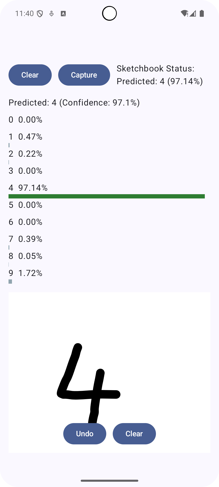

## Smart Sketchbook

An Android app (Jetpack Compose + Hilt) that lets you draw digits/shapes and classifies them on-device using TensorFlow Lite. It features smooth drawing, bitmap capture, adaptive preprocessing, multiple model support, OTA model swapping, and basic performance controls.

### Features
- Natural drawing canvas (rounded caps/joins, quadratic smoothing with corner preservation)
- Capture → preprocess → classify (TFLite) with confidence bars and loading state
- Hardware acceleration with NNAPI/GPU (fallback to CPU/XNNPACK)
- Model swap (digits/shapes), versioning, OTA simulation, internal storage loading
- Settings: CPU threads, model selection, delegate status
- Snackbar for low-confidence, haptics feedback, dynamic labels

### Screenshots

### Project Structure
- `app/src/main/java/com/example/smartsketchbook/ui/` — Compose UI (screens, components)
- `app/src/main/java/com/example/smartsketchbook/ui/viewmodel/` — `SketchbookViewModel` (state, capture, classification)
- `app/src/main/java/com/example/smartsketchbook/domain/ml/` — TFLite classes, preprocessing, model management
- `app/src/main/assets/` — TFLite models (e.g., `mnist_dynamic.tflite`)
- `docs/` — Architecture and UX reviews, FL concept

### Requirements
- Android Studio Giraffe/Koala or newer
- Android SDK 26+
- Gradle plugin/Kotlin as configured in `gradle/libs.versions.toml`

### Getting Started
1. Clone the repo and open in Android Studio.
2. Ensure a TFLite model exists in `app/src/main/assets/` (default: `mnist_dynamic.tflite`).
3. Build and run on device/emulator.

### Usage
1. Draw a digit on the canvas.
2. Tap Capture → the app crops, centers, scales, and classifies.
3. View predicted label and confidence bars.
4. Open Settings to change model or CPU threads.

### Models
- Digits (MNIST): `mnist_dynamic.tflite` (float/dynamic range). More tolerant than INT8.
- Shapes (placeholder): `shapes_classifier.tflite` (supply your own)
- Downloaded models: copied to internal storage via `ModelDownloader`/`ModelManager`.

### Preprocessing
- Digits: mass-centered, fit ~0.72–0.85 (currently 0.72), invert grayscale to match MNIST
- Shapes: RGB, fit 0.85, no inversion
- Bounding-box crop with padding to avoid clipping

### OTA & Versioning
- `AvailableModel` stores metadata (id, name, path/source, version, input shape, labels).
- `ModelManager` simulates remote version checks and downloads to internal storage with progress.
- Integrity TODO: add SHA-256 verification on downloaded files.

### Federated Learning (Concept)
- See `FEDERATED_LEARNING_CONCEPT.md` and `SketchbookDataClient` for data prep blueprint.

### Testing
- Unit: `SketchViewModelTest` with coroutines-test, mockk
- Instrumented: `SketchbookE2ETest` with Hilt + Compose testing

### Notes
- If INT8 model misclassifies (6→5/9), prefer the dynamic (float) model.
- You can retrain/export models with the provided Python script (see docs/Model Maker workflow).

